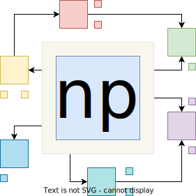

# netpack

netpack is an experiment to see if .NET written tooling can perform on an equal level to tools written in Rust or Go.

Right now netpack is not production ready and the likelihood that it works for your project is low.

If you like the idea and want to see this become a real thing then either support via code contributions or by sponsoring the project.

## Performance

The whole project is mostly geared towards performance. The key idea is that .NET with AoT (Ahead-of-Time compilation, i.e., no runtime dependency) can be on the same level as Go or Rust. While it still contains a GC (garbage collector, i.e., automatic memory management), the startup time is much improved. There is no JIT that is required to be run - giving instantly good performance.

| Test                | esbuild     | rspack      | **netpack** |
| ------------------- | ----------- | ----------- | ----------- |
| Small lib           |             |             |             |
| Small project       |             |             |             |
| Medium project      |             |             |             |
| Large project       |             |             |             |

Besides performance there are other reasons for choosing C#/.NET. It's arguably more readable than Rust, more powerful than Go, and better performing than JavaScript. The ecosystem, however, is lacking.

Another reason for having *another* bundler (but in .NET) is that it could be used *natively* within the .NET ecosystem, e.g., the post-process or optimize ASP.NET Core and / or Blazor web applications.

## Overview

The following items are features or topics that are relevant for bundlers - netpack in particular.

### General Features

- [x] Handle JavaScript
- [ ] Handle TypeScript
- [x] Handle images
- [x] Handle any asset
- [x] Handle CSS
- [ ] Handle SASS
- [x] Handle HTML
- [x] Handle JSON
- [ ] Handle codegen

### Bundler Basics

- [ ] Sourcemaps
- [x] Minification
- [x] DevServer
- [x] Bundle analyzer
- [ ] Image / asset variants (e.g., width/height optimized)
- [x] Copy public assets
- [x] Externals
- [ ] True HMR (not just refresh)

### More Advanced Topics

- [x] Importmap support
- [ ] Module Federation support
- [ ] Native Federation support
- [ ] React Fast Refresh support
- [ ] Platforms (web, npm)
- [ ] Other formats (esm, cjs, systemjs, umd)

## Idea Stash

Integration ideas / explorations:

- [Evaluate SASS from its official lib](https://github.com/Taritsyn/LibSassHost)
